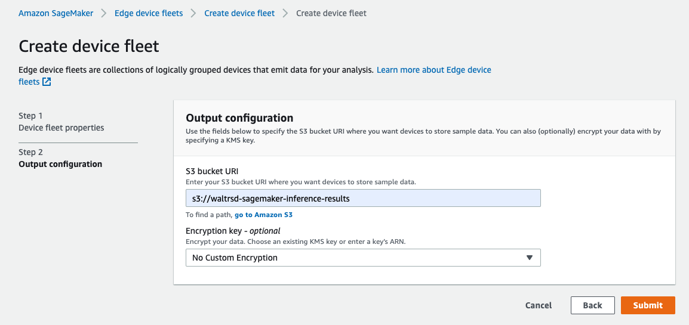
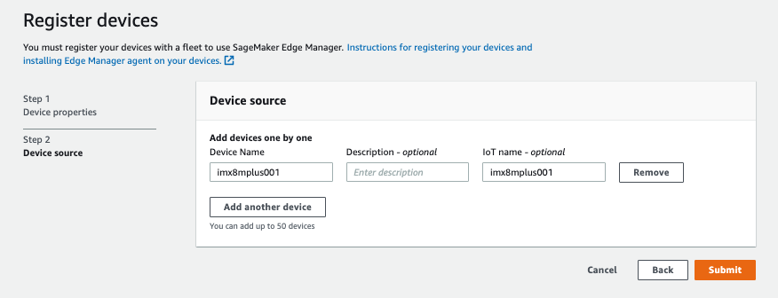
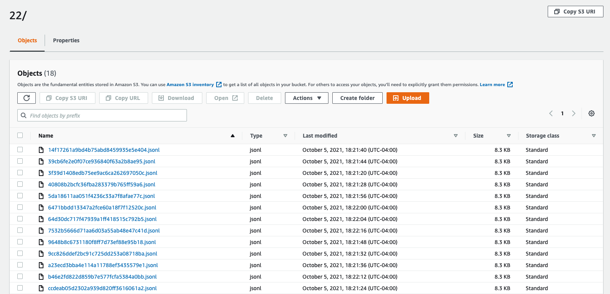

# AWS IoT Greengrass V2 and Amazon SageMaker Edge Manager with the NXP i.MX 8M Plus


This workshop walks you through the end to end flow using a pre-trained mobilenetv2 image classification model to perform image classification at the edge on images captured from an RTSP stream. Inference is performed on the Neural Processing Unit of the i.MX8MPlus which allows for up to a 50x performance increase compared to running on a CPU only. Results are uploaded to AWS IoT and input and output tensors are uploaded to Amazon S3.

This is an advanced workshop intended for those already familiar with basic AWS IoT Greengrass and AWS Cloud concepts.

## **Preparation:**

This workshop must be run on an NXP i.MX 8M Plus EVK.

You will need to build a Linux image for the i.MX8MPEVK that includes AWS IoT Greengrass V2. Follow the steps outlined in [https://github.com/aws-samples/meta-aws-demos/tree/master/nxp-imx8m/aws-iot-greengrass-v2](https://github.com/aws-samples/meta-aws-demos/tree/master/nxp/imx8m) to include the Greengrass V2 software with your [i.MX Yocto Linux build](https://www.nxp.com/docs/en/user-guide/IMX_YOCTO_PROJECT_USERS_GUIDE.pdf). This image will include all necessary dependencies to run this workshop.


**Requirements:**

* NXP i.MX8MPEVK with [AWS IoT Greengrass V2](https://docs.aws.amazon.com/greengrass/v2/developerguide/install-greengrass-core-v2.html) installed
    * Follow the instructions here: [https://github.com/aws-samples/meta-aws-demos/tree/master/nxp-imx8m/aws-iot-greengrass-v2](https://github.com/aws-samples/meta-aws-demos/tree/master/nxp-imx8m/aws-iot-greengrass-v2) to build an image for the i.MX8MPEVK with all required dependencies.
* A certificate and private key provisioned to your device.
* Your device is connected and appears as a Greengrass Core device in AWS IoT Greengrass cloud service. 
* The Greengrass device has an IoT Thing Name that matches the regex: ``^[a-zA-Z0-9](-*[a-zA-Z0-9]){0,62}$`` due to SageMaker Edge Manager limitation
* Host/development machine with a Unix terminal (Linux or Mac OS)
* [AWS CLI](https://docs.aws.amazon.com/cli/latest/userguide/cli-chap-install.html) installed and configured on host machine
* An IP camera that has an RTSP stream accessible by the NXP i.MX8MPEVK

## **Clone the Example on Host**

```
git clone https://github.com/aws-samples/greengrass-v2-sagemaker-edge-manager-python
```

## **Create or edit an IoT Role Alias for SageMaker Edge Manager**

The SageMaker Edge Manager Agent on the device will need to access resources in the Cloud. It uses the AWS IoT Credential Provider Role Alias to perform actions. 

First, we will need to create or edit the Role in IAM. When you set up your AWS IoT Greengrass Core device, you may have already performed this step.

### **If you already set up a Role for your AWS IoT Greengrass device:**

Navigate to **AWS IoT Core Console → Secure → Role Aliases --> your Role Alias --> Edit IAM Role**

Go to **Setup permissions for the IAM Role**

### **If you have not set up an IAM Role yet:**

Navigate to **AWS IAM Console → Roles → Create role**

**Select type of trusted entity → AWS service**
Choose **IoT** and under **‘Select your use case’** choose **IoT.**

Click on **‘Next: Permissions’, ‘Next: Tags’, ‘Next': Review'.**

* Role name: SageMaker-IoTRole

Click on ‘**Create role**’

### Setup permissions for the IAM Role

Once the role is created, we need to attach policies and authorize the IoT Credential Provider to access it.

Choose your created role from the list of IAM Roles. Click on **‘Attach Policies’** and attach the following policies:

* AmazonSageMakerEdgeDeviceFleetPolicy
* AmazonS3FullAccess

In addition, check that the following policies are attached:
* AWSIoTLogging
* AWSIoTRuleActions
* AWSIoTThingsRegistration

Click on **‘Trust relationships’ → ‘Edit trust relationship’**

Add the following to the Policy Document and click on '**Update Trust Policy'**:

```
{
  "Version": "2012-10-17",
  "Statement": [
    {
      "Effect": "Allow",
      "Principal": {
        "Service": "credentials.iot.amazonaws.com"
      },
      "Action": "sts:AssumeRole"
    },
    {
      "Effect": "Allow",
      "Principal": {
        "Service": "sagemaker.amazonaws.com"
      },
      "Action": "sts:AssumeRole"
    }
  ]
}
```

Copy the **Role ARN** for use in the next steps when you create the Edge Manager device fleet.

## **Setup S3 bucket for Inference Results**

Edge Manager will upload inference results to this Amazon S3 Bucket. 

Amazon S3 bucket names need to be globally unique, so create a unique identifier to prepend the name of your S3 bucket and replace <unique-uuid> in the command below with this identifier. Replace <REGION> with the region in which your AWS IoT Greengrass device is connected. The string `sagemaker` must also be present in the bucket name.

Run the following command from your host machine:

```
aws s3 mb s3://<unique-uuid>-sagemaker-inference-results --region <REGION>
```

_It is best practice to restrict all Amazon S3 buckets from Public Access. You should enable this security feature for all Amazon S3 buckets created in this workshop. For more information, refer to [documentation](https://docs.aws.amazon.com/AmazonS3/latest/userguide/access-control-block-public-access.html)._

## **Create the Edge Manager Device Fleet**

Navigate to **Amazon Sagemaker Console → Edge Manager → Edge device fleets → Create device fleet**

**Device fleet properties:**
* **Device fleet name:** greengrassv2fleet
* **IAM Role:** The ARN of the IAM Role modified in the previous step. It is the same one that is linked to your IoT Role Alias. 
* **Create IAM role alias:** If you do not already have an AWS IoT Role Alias for your Greengrass device, select this option to create it and attach the provided IAM Role.


Click ‘Next’.

**Output configuration:**
* **S3 bucket URI**: ``s3://<your-inference-bucket-name>``
* **Encryption key**: No Custom Encryption



Click ‘Submit’ to finish creating the Edge Manager Fleet.

Navigate to **AWS IoT Console → Secure → Role Aliases**

You will see a role named SageMakerEdge-greengrassv2fleet with your IAM role attached if you chose to create a new IoT Role Alias.

## **Add your AWS IoT Greengrass Core Device to the Edge Manager Fleet**

Open the Amazon Sagemaker AWS Console. Navigate to **Edge Manager → Edge devices → Register devices**

**Device fleet name:** greengrassv2fleet (the name of your fleet)

Click ‘Next’

* **Device Name:** The name of your AWS IoT Core Greengrass Core Thing Name (MUST MATCH regex: ``^[a-zA-Z0-9](-*[a-zA-Z0-9]){0,62}$``)
* **IoT Name:** The name of your AWS IoT Core Greengrass Core Thing Name (Should be the same as Device Name)



Click ‘Submit’

## **Setup S3 Bucket for Greengrass Component Resources**

Artifacts that will be deployed to the Greengrass device, such as scripts, need to be stored in an Amazon S3 bucket where the device will download them during a Greengrass deployment.

Run this from your host machine:

```
aws s3 mb s3://<unique-uuid>-gg-components --region <REGION>
```

_It is best practice to restrict all Amazon S3 buckets from Public Access. You should enable this security feature for all Amazon S3 buckets created in this workshop. For more information, refer to [documentation](https://docs.aws.amazon.com/AmazonS3/latest/userguide/access-control-block-public-access.html)._

## **Deploy the SageMaker Edge Manager Agent Greengrass component to the device**

Next, we will deploy the Edge Manager Agent to the Greengrass device.

Navigate to the **AWS IoT Console → Greengrass → Deployments → Create**

* **Name:** ‘Deployment for ML using EM’
* **Deployment target:** Choose either ‘Core device’ to deploy this to a single IoT Thing, or ‘Thing group’ to deploy it to all Greengrass Cores in a Thing Group. In a production environment, Thing Groups can be used to deploy components to a fleet of devices


Click ‘Next’, and then select the components you want to include in your Greengrass Deployment.

**Public components:**

* **aws.greengrass.Nucleus** - this will update your Greengrass Nucleus to the latest version compatible with SageMaker Edge Manager.
* **aws.greengrass.TokenExchangeService** - the Edge Manager component depends on this to access the Amazon S3 bucket.
* **aws.greengrass.SageMakerEdgeManager** - this component deploys the SageMaker Edge Manager Agent component
* _OPTIONAL **aws.greengrass.CLI**_ - you can use this component to see the status of your components and to deploy new components locally on your device. This is not required for the workshop, but can be helpful for advanced development and debugging. For more information, see the [documentation](https://docs.aws.amazon.com/greengrass/v2/developerguide/gg-cli-reference.html)
   
Click ‘Next’


aws.greengrass.SageMakerEdgeManager component needs to be configured. Select the component and then click on ‘Configure Component’. In the ‘Configuration update’ field, input the following and change the values to match your environment and setup:

```
{
  "CaptureDataPeriodicUpload": "false",
  "CaptureDataPeriodicUploadPeriodSeconds": "8",
  "DeviceFleetName": "<your device fleet name>",
  "BucketName": "<your inference results bucket>",
  "CaptureDataBase64EmbedLimit": "3072",
  "CaptureDataPushPeriodSeconds": "4",
  "SagemakerEdgeLogVerbose": "false",
  "CaptureDataBatchSize": "10",
  "CaptureDataDestination": "Cloud",
  "FolderPrefix": "sme-capture",
  "UnixSocketName": "/tmp/sagemaker_edge_agent_example.sock",
  "CaptureDataBufferSize": "30"
}
```

* **DeviceFleetName** is the name of your Edge Manager Device Fleet name created in the step Create the Edge Manager Device Fleet
* **BucketName** is where your inference results will be uploaded to. This is the bucket you created in the step Setup S3 bucket for Inference Results.
* **UnixSocketName** is the name of the socket in which other Greengrass compoenents can communicate with the Edge Manager Agent. Ensure it is set to ``/tmp/sagemaker_edge_agent_example.sock``.
   
For a full list of SageMaker Edge Manager Agent Component configuration parameters, [see the documentation.](https://docs.aws.amazon.com/greengrass/v2/developerguide/sagemaker-edge-manager-component.html)


Once you have configured your Greengrass component, click ‘Confirm’. Then click ‘Next’. If you do not wish to configure any advanced settings, click ‘Next’ again. Review the deployment for any errors, then click on ‘Deploy’.

Monitor the state of the deployment from the AWS IoT Greengrass console. You can also monitor the state of the deployment from the device by running:

```
sudo tail -f /greengrass/v2/logs/greengrass.log
```

The output of the Greengrass log should contain lines similar to the following:

```
2021-04-07T21:05:41.142Z [INFO] (pool-2-thread-19) com.aws.greengrass.componentmanager.ComponentStore: delete-component-start. {componentIdentifier=aws.greengrass.SageMakerEdgeManager-v0.1.0}
2021-04-07T21:05:41.157Z [INFO] (pool-2-thread-19) com.aws.greengrass.componentmanager.ComponentStore: delete-component-finish. {componentIdentifier=aws.greengrass.SageMakerEdgeManager-v0.1.0}
2021-04-07T21:05:44.580Z [INFO] (pool-2-thread-12) com.aws.greengrass.deployment.DeploymentService: Current deployment finished. {DeploymentId=be1736e2-cb47-4a6a-a561-5e089dd4822f, serviceName=DeploymentService, currentState=RUNNING}
2021-04-07T21:05:44.663Z [INFO] (pool-2-thread-12) com.aws.greengrass.deployment.IotJobsHelper: Updating status of persisted deployment. {Status=SUCCEEDED, StatusDetails={detailed-deployment-status=SUCCESSFUL}, ThingName=iMX8MQEVK_GG_Core_001, JobId=be1736e2-cb47-4a6a-a561-5e089dd4822f}
2021-04-07T21:05:49.410Z [INFO] (Thread-4) com.aws.greengrass.deployment.IotJobsHelper: Job status update was accepted. {Status=SUCCEEDED, ThingName=iMX8MQEVK_GG_Core_001, JobId=be1736e2-cb47-4a6a-a561-5e089dd4822f}
2021-04-07T21:05:49.849Z [INFO] (pool-2-thread-12) com.aws.greengrass.status.FleetStatusService: fss-status-update-published. Status update published to FSS. {serviceName=FleetStatusService, currentState=RUNNING}
```

To check if the Edge Manager Agent was successfully deployed, tail the component log on the device:

```
sudo tail -f /greengrass/v2/logs/aws.greengrass.SageMakerEdgeManager.log
```

You should see the Edge Manager Agent parse the configuration file and open up a socket on the device.

```
2021-07-13T19:43:13.511Z [INFO] (Copier) aws.greengrass.SageMakerEdgeManager: stdout. Server listening on unix:///tmp/sagemaker_edge_agent_example.sock. {scriptName=services.aws.greengrass.SageMakerEdgeManager.lifecycle.run.script, serviceName=aws.greengrass.SageMakerEdgeManager, currentState=RUNNING}
```

This socket is used by the Edge Manager Agent to send and receive requests using GRPC. Additional Greengrass v2 components developed to talk to the Edge Manager Agent should utilize this socket to load ML models and request predictions by that model.

## Upload the uncompiled mobilenetv2 model to Amazon S3

In this workshop, we will use a pre-trained model distributed by TensorFlow. Navigate to  [TensorFlow Lite Sample Models](https://www.tensorflow.org/lite/guide/hosted_models) and download Mobilenet_v2_1.0_224_quant by clicking 'tflite&pb'.

Upload the model to Amazon S3.

```
aws s3 cp mobilenetv2_1.0_224_quant.tgz s3://<Components S3 Bucket Name>/models/uncompiled/mobilenet_v2_1.0_224_quant.tgz
```

Replace <Components S3 Bucket Name> with the name of your bucket created in the step ****Setup S3 Bucket for Greengrass Component Resources**.

## Compile the TFLite mobilenetv2 model using SageMaker Neo

Next, we will compile the model to optimize and take advantage of the architecture and hardware acceleration of the device on the edge. SageMaker Neo utilizes the Apache TVM open source compiler for CPU, GPU, and NPU machine learning accelerators.

Open the **Amazon SageMaker console** **→ Inference → Compilation jobs → Create compilation job**

* **Job settings:**
    * **Job name:** mobilenetv2-Quantized-model
    * **IAM Role:** 
        * Create a new role
        * **S3 buckets you specify:** Any S3 Bucket
        * Click on ‘Create role’   
* **Input configuration:**
    * **Location of model artifacts:** ``s3://<Components S3 Bucket Name>/models/uncompiled/mobilenet_v2_1.0_224_quant.tgz``
        * This is the location of the uncompiled model from the previous step.
    * **Data input configuration:** {"input":[1, 224, 224, 3]}
        * This is the input shape of the data for the model
    * **Machine learning framework:** TFLite


* Output configuration
    * **Target device:** imx8mplus
    * **S3 Output location:** ``s3://<Components S3 Bucket Name>/models/compiled``

Click on ‘Submit’. The compilation job will take 2-3 minutes. When it is finished, the Status will change to ‘COMPLETED’

Open the compilation job from the Amazon SageMaker console and note the S3 compiled model artifact S3 URI. Check that the compiled model is in the specified Amazon S3 bucket.


## Package the compiled model for Edge Manager

Next we will prepare the model to integrate with the Edge Manager Agent. The packaging job will sign the model’s hash so that the device can verify it’s integrity.

Open the **Amazon SageMaker console** **→ Edge Manager→ Edge packaging job → Create Edge packaging job**

* **Edge packaging job name:** imx8mplus-mobilenetv2-packaging-001
* **Model name:** mobilenetv2-224-10-quant
* **Model version:** 1.0
* **IAM role:**
    * Create a new role
    * Any S3 bucket
    * Create Role
    * After the role is created, click on the created Role which should be named similar to: AmazonSageMaker-ExecutionRole-20210803T115161. Click on 'Attach policies' and add 'AWSGreengrassFullAccess'.
   


Click ‘Next’

* **Compilation job name:** mobilenetv2-Quantized-Model (this is the name of the compilation job from the Neo compilation job)

Click ‘Next’

* **S3 bucket URI:** ``s3://<Components S3 Bucket Name>/models/packaged/``
* Click on 'Greengrass V2 component'
  * **Component name:** mobilenetv2_224_quantized_model_component
  * **Component description:** Packaged Mobilenetv2 uint8 quantized model
  * **Component version:** 1.0.0


Click ‘Submit’. The packaging job will take approximately 2-3 minutes. When it is done the Status will change to ‘COMPLETED’

Check that the packaged model is present in the Amazon S3 output location provided above. The Greengrass component should also be created. Navigate to the **AWS IoT Console → Greengrass → Components** and check that 'mobilenetv2_224_quantized_model_component' is present.


## **Create the Greengrass component for the application**

The application is what implements the Edge Manager Agent client, opens the RTSP stream, does the pre-processing of frames, and post-processing of inference results.

The Edge Manager Agent uses Protobuf and GRPC to communicate. The application needs to communicate with the Edge Manager Agent over GRPC and needs to implement the correct Protobuf calls. 

Review the code in the camera_integration_edgemanger_client.py script. Note the lifecycle of the model. 


Upload the GRPC client, Python application, and sample images to S3 from your host machine:

```
cd ~/greengrass-v2-sagemaker-edge-manager-python <this is the root of your project>

aws s3api put-object --bucket <your-gg-components-bucket> --key artifacts/aws.sagemaker.edgeManagerClientCameraIntegration/0.1.0/agent_pb2_grpc.py --body components/artifacts/aws.sagemaker.edgeManagerClientCameraIntegration/0.1.0/agent_pb2_grpc.py
aws s3api put-object --bucket <your-gg-components-bucket> --key artifacts/aws.sagemaker.edgeManagerClientCameraIntegration/0.1.0/agent_pb2.py --body components/artifacts/aws.sagemaker.edgeManagerClientCameraIntegration/0.1.0/agent_pb2.py
aws s3api put-object --bucket <your-gg-components-bucket> --key artifacts/aws.sagemaker.edgeManagerClientCameraIntegration/0.1.0/camera_integration_edgemanger_client.py --body components/artifacts/aws.sagemaker.edgeManagerClientCameraIntegration/0.1.0/camera_integration_edgemanger_client.py
```

Open the file ``components/recipes/aws.sagemaker.edgeManagerClientCameraIntegration-0.1.0.yaml``. Change the URIs under ‘Artifacts’ to include the correct S3 bucket name where you uploaded the artifacts. You should change <YOUR BUCKET NAME> to the name of your Greengrass component bucket. 

Navigate to the **AWS IoT Console → Greengrass → Components → Create Component**

Choose ‘Enter recipe as YAML’ and copy the contents of /recipes/aws.sagemaker.edgeManagerClientCameraIntegration-0.1.0.yaml into the Recipe text box.

Click on ‘Create Component’, and then check to ensure that the Status of the component is ‘Deployable’. Review the component description for any errors.


## **Deploy Model and Application Components to the Edge**

Navigate to the **AWS IoT Console → Greengrass → Deployments**

Click the checkmark box next to the previously created deployment ‘Deployment for ML using EM’ and then click on ‘Revise’.

Click ‘Next’ and on the ‘Select components’ menu, turn off the option ‘Show only selected components’ for ‘My components’. 

Select ‘mobilenetv2_224_quantized_model_component’ and ‘aws.sagemaker.edgeManagerClientCameraIntegration’.


Click ‘Next’, and select the aws.sagemaker.edgeManagerClientCameraIntegration component. lick on ‘Configure Component’. In the ‘Configuration update’ field, input the following, and update the RTSP stream URL to point to the stream from your IP Camera.

```
{
    "rtspStreamURL": "rtspt://<YOUR RTSP STREAM IP ADDRESS>",
    "modelComponentName": "mobilenetv2_224_quantized_model_component",
    "modelName": "mobilenetv2-224-10-quant",
    "quantization": "True",
    "captureData": "False"
}
```

 then click ‘Confirm’ and then 'Next'. Leave the advanced settings as defaults and then click ‘Next’ again.

Review the deployment, then when you are ready to deploy the components to the device click on ‘Deploy’. 

Wait 2-3 minutes and then check that your Greengrass Core device is HEALTHY from the AWS IoT Greengrass console:


To check if the application was successfully deployed, tail the SageMaker component log on the device:

```
sudo tail -f /greengrass/v2/logs/aws.greengrass.SageMakerEdgeManager.log
```

If the LoadModel request from the application was successful, the Edge Manager Agent log will show the meta data about the machine learning model:

```
2021-10-05T22:05:18.387Z [INFO] (Copier) aws.greengrass.SageMakerEdgeManager: stdout. {"version":"1.20210512.96da6cc"}[2021-10-05T22:05:18.387][I] backend name is tvm. {scriptName=services.aws.greengrass.SageMakerEdgeManager.lifecycle.run.script, serviceName=aws.greengrass.SageMakerEdgeManager, currentState=RUNNING}
2021-10-05T22:05:18.387Z [INFO] (Copier) aws.greengrass.SageMakerEdgeManager: stdout. {"version":"1.20210512.96da6cc"}[2021-10-05T22:05:18.387][I] DLR backend = kTVM. {scriptName=services.aws.greengrass.SageMakerEdgeManager.lifecycle.run.script, serviceName=aws.greengrass.SageMakerEdgeManager, currentState=RUNNING}
2021-10-05T22:05:18.387Z [INFO] (Copier) aws.greengrass.SageMakerEdgeManager: stdout. {"version":"1.20210512.96da6cc"}[2021-10-05T22:05:18.387][I] Finished populating metadata. {scriptName=services.aws.greengrass.SageMakerEdgeManager.lifecycle.run.script, serviceName=aws.greengrass.SageMakerEdgeManager, currentState=RUNNING}
2021-10-05T22:05:18.387Z [INFO] (Copier) aws.greengrass.SageMakerEdgeManager: stdout. {"version":"1.20210512.96da6cc"}[2021-10-05T22:05:18.387][I] Model:mobilenetv2-224-10-quant loaded!. {scriptName=services.aws.greengrass.SageMakerEdgeManager.lifecycle.run.script, serviceName=aws.greengrass.SageMakerEdgeManager, currentState=RUNNING}
```

Next, check the logs of the application on the device:
```
sudo tail -f /greengrass/v2/logs/aws.sagemaker.edgeManagerClientCameraIntegration.log
```
You will see the prediction requests and results in the log.

## **Get the Inference Results on AWS IoT Core**

Inference results should be published to AWS IoT Core. 

To check the inference results arriving in AWS IoT Core, Navigate to the **AWS IoT Console → Test → MQTT test client.**

Under ‘Subscribe to a topic’, type in ‘em/inference’. Every second, inference results should arrive on the ‘em/inference’ topic with the result and confidence level.


The result is an index to the Imagenet1000 image classification label. For example, '968' corresponds to 'cup'.

## **Turn on inference data capture**

After your device is deployed to the field, you may want to see how your model is performing at the edge. You can turn on data capture in the Edge Manager Python application to have raw input and output tensors, as well as meta data, published for each inference call.

First, modify your Greengrass v2 deployment to turn on this feature.

Navigate to the **AWS IoT Console → Greengrass → Deployments**

Click the checkmark box next to the previously created deployment ‘Deployment for ML using EM’ and then click on ‘Revise’.

Click ‘Next’ and on the ‘Select components’ menu, and then 'Next' again to leave the same components in the deployment. 

Select ‘aws.sagemaker.edgeManagerClientCameraIntegration' and then click on 'Configure component'.

Under 'Configuration to merge' input the following to turn on data capture:
```
{
  "captureData": "True"
}
```


To check the inference results meta data, input and output tensors from Amazon S3,Navigate to the **Amazon S3 console → <your-inference-bucket-name>.**

In this S3 bucket, the following folder hierarchy should be present:

* ‘sme-capture’ ( you specified in your Edge Manager Greengrass component configuration and Edge Manager device setup)
    * greengrassv2fleet ( name of your Edge Manager Device Fleet)
        * mobilenetv2-224-10-quant (name of your model from the Edge Manager packaging job)
            * year
                * month
                    * day
                        * hour

Inside the ‘hour’ folder there will be .jsonl objects. These .jsonl files contain meta-data about each inference prediction and results. The output tensor will be found in the jsonl file. It is a base64 encoded array of confidence levels to classification. In the raw-data/input-tensors is additional data including the input data shape and raw image.



## **Conclusion**
With AWS IoT Greengrass v2 and Amazon SageMaker, you can build models in the cloud, deploy them to the edge, and monitor them in the cloud. Taking advantage of the NPU on the i.MX8MPlus allows you to run fast, energy efficient inference at the edge. This completes the full Machine Learning Operations pipeline to manage your IoT ML fleets at scale.

## Clean up
When you are done with this workshop example, you should clean up the AWS resources in your account to prevent any additional costs. 

### Device
First, shutdown AWS IoT Greengrass on the device. Run the following command on the device to stop Greengrass from running and prevent it from starting up on device reboot:
```
sudo systemctl stop greengrass
sudo systemctl disable greengrass
```

This stops data from being published to AWS IoT Core, SageMaker Edge Manager S3 bucket uploads, and the application to stop running.

### Storage of Inference Results
Delete Amazon S3 buckets containing inference data by following the instructions [in documentation](https://docs.aws.amazon.com/AmazonS3/latest/userguide/delete-bucket.html) on the bucket named ```<unique-uuid>-sagemaker-inference-results```.

### AWS IoT Greengrass
You might also wish to delete the AWS IoT Greengrass cloud resources. Leaving them provisioned in AWS IoT will not incur additional charges.

#### Delete the Core
From the host machine run the following command:
```
aws greengrassv2 delete-core-device --core-device-thing-name MyGreengrassCore
```
Replace 'MyGreengrassCore' with the IoT Thing Name of your Greengrass device.

#### Delete the Components
Delete Amazon S3 buckets containing inference data by following the instructions [in documentation](https://docs.aws.amazon.com/AmazonS3/latest/userguide/delete-bucket.html) on the bucket named ```<unique-uuid>-gg-components```.

Navigate to **AWS IoT Console --> Greengrass --> Components**
Click on 'aws.sagemaker.edgeManagerClientCameraIntegration' and then 'Delete version' then confirm by clicking 'Delete'
Click on 'mobilenetv2_224_quantized_model_component' and then 'Delete version' then confirm by clicking 'Delete'

### Delete SageMaker Edge Manager resources

Navigate to **Amazon SageMaker Console --> Edge Manager --> Edge devices**
Click on the device name to delete, and then click on 'Deregister'. Follow the prompt to deregister the device.